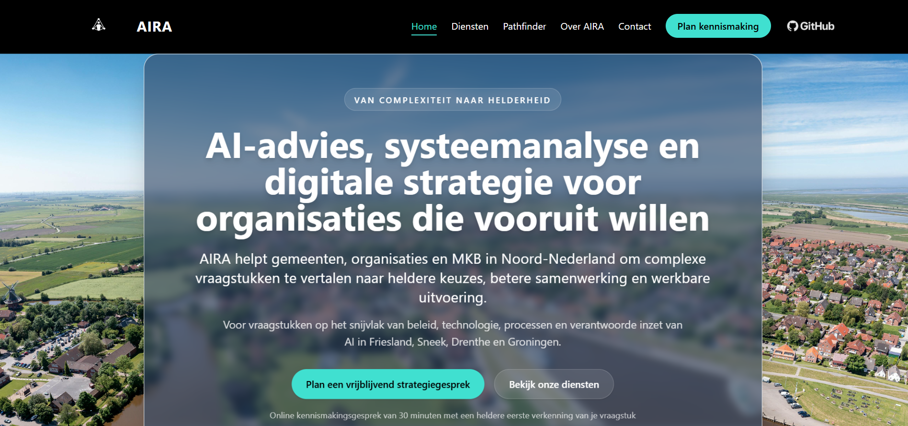
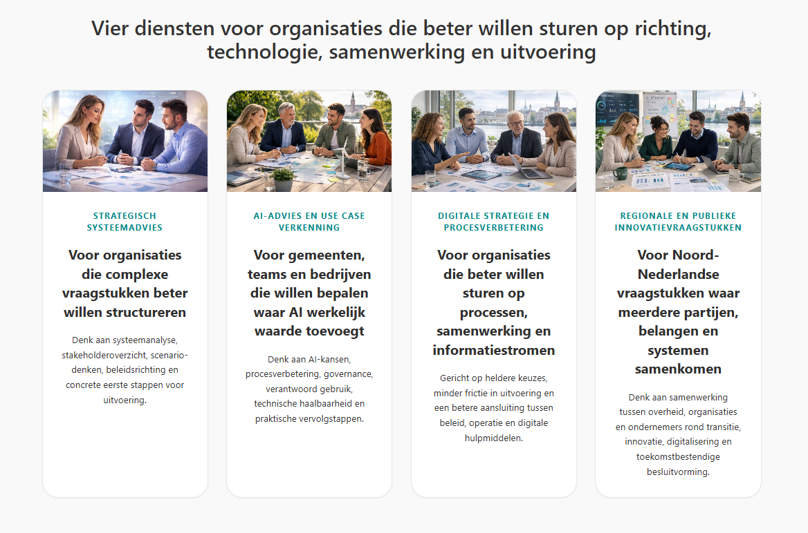
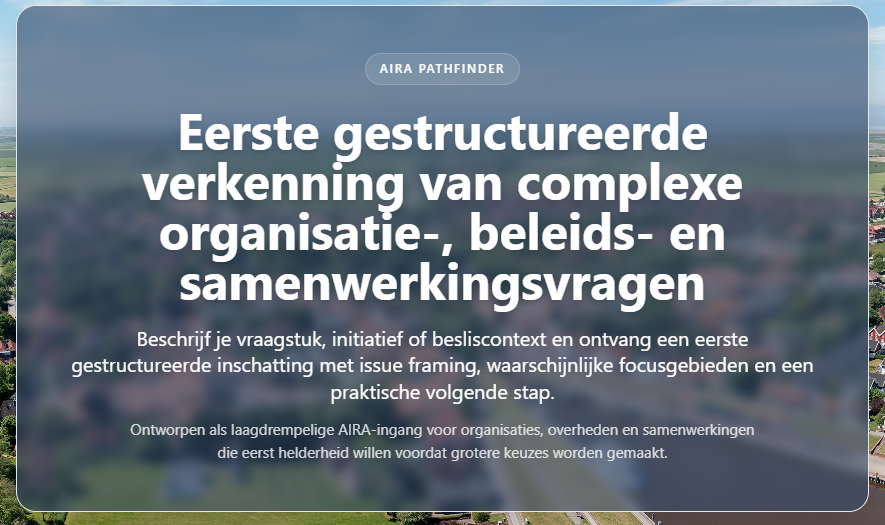

# AIRA Web Platform Showcase

Frontend and UX showcase for the AIRA advisory platform.

## Screenshots

### Website homepage

### Services page

### Pathfinder page

## Overview

AIRA Web Platform Showcase presents the public-facing design and UX direction of AIRA’s advisory platform.

The showcase demonstrates how AIRA combines:

- clear positioning
- calm and credible visual design
- practical AI entry points
- structured service presentation
- trust-oriented user experience

## What this repository demonstrates

- frontend structure and layout thinking
- advisory-oriented UX design
- Laravel-based public web implementation
- consistent presentation of AI services
- practical conversion paths for consultancy and AI workflows

## Areas represented

- homepage
- services page
- Pathfinder entry page
- public-facing platform experience
- contact and trust-building flows

## Stack used in the live project

The broader implementation around the AIRA website and platform showcase has involved technologies such as:

- Laravel
- Blade templates
- Tailwind CSS
- JavaScript
- AI service integration in adjacent platform components

## Notes

This repository is a public showcase repository. It is intended to demonstrate product presentation, implementation style, and UX direction.

It does **not** expose sensitive internal logic, private configuration, secrets, or proprietary orchestration components.

## Website

[AIRA](https://www.aira-ai.com)

## Author

Arjen Wibbens  
Founder, AIRA
